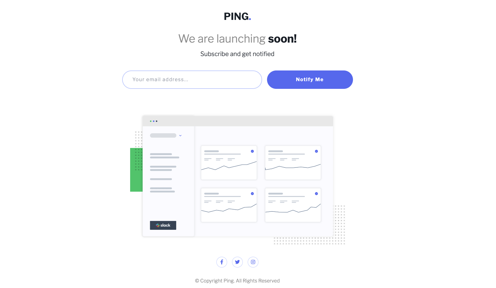
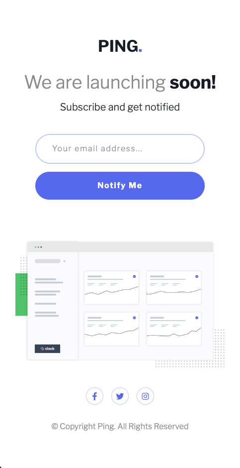

# Frontend Mentor - Ping coming soon page

## Table of contents

- [Frontend Mentor - Ping coming soon page](#frontend-mentor---ping-coming-soon-page)
	- [Table of contents](#table-of-contents)
	- [Overview](#overview)
		- [The challenge](#the-challenge)
		- [Screenshot](#screenshot)
		- [Links](#links)
	- [My process](#my-process)
		- [Built with](#built-with)
		- [What I learned](#what-i-learned)
		- [Future Development](#future-development)
	- [Author](#author)

## Overview

### The challenge

Users should be able to:

- View the landing page on optimal screens.

### Screenshot

### Links

- Solution URL: [View Github Code](https://github.com/jchapar/ping_FEM)
- Live Site URL: [Visit Site](https://gilded-kitsune-c0532d.netlify.app/)

## My process

### Built with

- HTML 5
- Tailwind CSS
- Flexbox
- Mobile-first workflow
- Figma - For design files

### What I learned

- Continued improvement with TailwindCss.

### Future Development

- Implement JavaScript for form validation.

## Author

- Frontend Mentor - [@jchapar](https://www.frontendmentor.io/profile/jchapar)
- Twitter - [@j_chapar](https://www.twitter.com/j_chapar)
- Instagram - [@\_jchapar](https://www.instagram.com/_jchapar)
